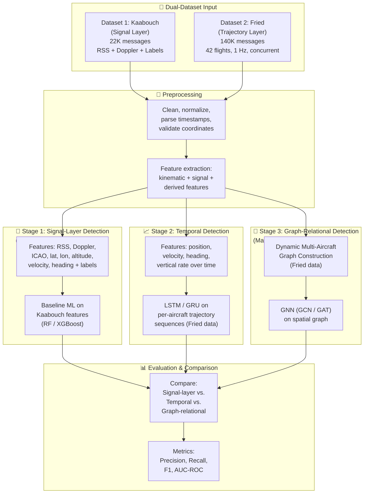

# AeroGuard AI

**Multi-Layer ADS-B Spoofing Detection: From Signal Analysis to Graph Neural Networks**

---

## Project Overview

AeroGuard AI investigates **ADS-B (Automatic Dependent Surveillance–Broadcast) spoofing detection** through a multi-layer analysis framework. The project compares detection at two distinct layers of the ADS-B communication system:

1. **Signal Layer** — Analysing physical communication features (Received Signal Strength, Doppler shift) to detect injection attacks at the wireless channel level
2. **Spatial-Relational Layer** — Modelling multiple aircraft as a dynamic graph and using **Graph Neural Networks (GNNs)** to detect spatially inconsistent behaviour across the airspace

By comparing signal-level classification against trajectory-level graph analysis, AeroGuard explores whether multi-aircraft relational reasoning can outperform communication-layer detection for identifying spoofed ADS-B transmissions.

## Problem Statement

ADS-B is the primary surveillance technology in modern air traffic management, operating as an **unauthenticated broadcast on 1090 MHz**. Any entity with a software-defined radio (SDR) transmitter can inject fabricated ADS-B messages into the communication channel. This makes ADS-B vulnerable to:

- **Path modification** — injecting false GPS coordinates to alter an aircraft's reported trajectory
- **Ghost aircraft injection** — creating phantom aircraft on ATC surveillance displays
- **Velocity drift** — gradually manipulating reported speed values to mislead separation assurance
- **Message replay attacks** — re-broadcasting previously captured legitimate transmissions

These attacks exploit the fundamental design of ADS-B as an unauthenticated digital communication protocol — a core concern in Software Defined Communication security.

## Motivation

- ADS-B is **mandated globally** (FAA NextGen, EASA) yet transmits without encryption or source authentication.
- Existing detection methods either analyse **signal characteristics** (RSS, Doppler) or **trajectory patterns** (position, velocity) — but rarely both.
- **Signal-level approaches** (RSS, Doppler) can detect injection from unauthorized transmitters but cannot catch sophisticated attacks that mimic legitimate signal profiles.
- **Trajectory-level approaches** detect kinematic anomalies per aircraft but treat each aircraft independently, ignoring spatial context.
- **No existing work** systematically compares signal-layer detection against spatial-relational (GNN-based) detection for ADS-B spoofing — this is the gap AeroGuard addresses.

## Research Gap

| Existing Approach | What It Does | Limitation |
|---|---|---|
| Signal feature classification (RSS, Doppler) | Detects injection via communication-layer anomalies | Cannot detect attacks with legitimate signal profiles |
| Single-aircraft ML (Isolation Forest, Autoencoder) | Detects kinematic anomalies per flight | Ignores spatial relationships between aircraft |
| LSTM / RNN sequence models | Captures temporal trajectory patterns | Still per-aircraft; no multi-aircraft context |
| RF fingerprinting (PHY-layer) | Authenticates individual transmitters via IQ samples | Requires raw IQ hardware; not scalable |

**AeroGuard's contribution**: A **multi-layer comparison framework** that evaluates ADS-B spoofing detection across the communication signal layer (RSS, Doppler) and the spatial-relational layer (GNN on dynamic multi-aircraft graph), using two complementary public datasets.

---

## Selected Datasets

AeroGuard uses a **dual-dataset approach** — each dataset is selected for what it does best, and neither is misrepresented.

### Dataset 1 (Signal Layer): ADS-B Message Injection Attacks Dataset

| Property | Details |
|---|---|
| **Name** | ADS-B Message Injection Attacks Dataset |
| **Authors** | Hadjar Ould Slimane, Selma Benouadah, Naima Kaabouch (University of North Dakota) |
| **DOI** | [10.17632/6fhw732ccz.1](https://doi.org/10.17632/6fhw732ccz.1) |
| **Download** | [https://data.mendeley.com/datasets/6fhw732ccz/1](https://data.mendeley.com/datasets/6fhw732ccz/1) |
| **Size** | 22,316 ADS-B messages |
| **Format** | CSV |
| **Features** | 17 features — 15 decoded ADS-B fields + **Received Signal Strength (RSS)** + **Doppler shift** |
| **Labels** | ✅ `0` = Legitimate, `1` = Path modification, `2` = Ghost aircraft injection, `3` = Velocity drift |
| **Source** | Authentic messages from OpenSky Network + simulated injection attacks |
| **SDC Relevance** | **High** — RSS and Doppler shift are direct physical-layer communication measurements |
| **License** | CC BY 4.0 |

**Role in AeroGuard**: Signal-layer analysis. This dataset provides the **communication features** (RSS, Doppler) that ground the project in Software Defined Communication. Baseline ML classifiers will be trained on these signal + message features to establish how well communication-layer detection performs.

### Dataset 2 (Spatial-Relational Layer): ADS-B Air Traffic for Anomalous Trajectory Detection

| Property | Details |
|---|---|
| **Name** | ADS-B Air Traffic for Anomalous Trajectory Detection |
| **Author** | Asaf Fried |
| **DOI** | [10.17632/4x578h29f6.1](https://doi.org/10.17632/4x578h29f6.1) |
| **Download** | [https://data.mendeley.com/datasets/4x578h29f6/1](https://data.mendeley.com/datasets/4x578h29f6/1) |
| **Size** | ~139,625 messages across 42 flights |
| **Format** | CSV |
| **Columns** | `icao24`, `lat`, `lon`, `baroaltitude`, `velocity`, `heading`, `vertical_rate`, `onground`, `callsign`, timestamp |
| **Sampling Rate** | 1 Hz (one message per second) |
| **Concurrent Aircraft** | 25 training + 10 validation flights from the **same 4-hour window** (LPPC FIR, Jan 1 2020) — aircraft fly simultaneously in the same airspace |
| **Labels** | ✅ 10-minute injected anomaly windows in test flights (Gaussian noise + spoofed trajectories) |
| **Pre-split** | Train (25 flights) / Validation (10 flights) / Test (7 flights) |
| **Source** | OpenSky Network (real ADS-B captures via RTL-SDR receivers) |
| **Associated Paper** | Fried & Last, *"Facing Airborne Attacks on ADS-B Data with Autoencoders"*, Computers & Security, 2021 |
| **License** | CC BY 4.0 |

**Role in AeroGuard**: Spatial-relational analysis. This dataset provides **multi-aircraft concurrent trajectory data** needed to construct the dynamic graph for the GNN. Multiple aircraft share the same airspace and time window, enabling proximity-based edges and spatial context.

### Why Two Datasets?

| Requirement | Kaabouch Dataset | Fried Dataset | Together |
|---|---|---|---|
| Signal/communication features (RSS, Doppler) | ✅ | ❌ | ✅ |
| Multi-aircraft concurrent trajectories for graph | ❌ | ✅ | ✅ |
| Spoofing/anomaly labels | ✅ (3 attack types) | ✅ (noise + spoofed trajectories) | ✅ |
| SDC course relevance | ✅ High | ⚠️ Medium | ✅ High |
| GNN feasibility | ❌ Not graph-structured | ✅ Perfect | ✅ |

> **No single public ADS-B dataset provides both signal-level communication features AND multi-aircraft trajectory data with spoofing labels.** The dual-dataset approach uses each dataset for what it is designed for, without misrepresenting either.

---

## Software Defined Communication Relevance

AeroGuard is developed under the **Software Defined Communication (SDC)** course (23AID203). The project connects to SDC through the following aspects:

### Direct SDC Connections

| SDC Concept | AeroGuard Connection |
|---|---|
| **ADS-B as a digital communication protocol** | ADS-B operates on **1090 MHz** using **Pulse Position Modulation (PPM)** as an unauthenticated broadcast. The project analyses the security of this communication protocol. |
| **Received Signal Strength (RSS)** | The Kaabouch dataset includes RSS measurements — a fundamental physical-layer property of wireless communication used to characterize signal propagation and detect anomalous transmitters. |
| **Doppler shift** | The Kaabouch dataset includes Doppler shift — the frequency displacement caused by relative motion between transmitter (aircraft) and receiver (ground station). This is a core concept in communication systems and signal analysis. |
| **SDR / RTL-SDR** | Both datasets originate from the **OpenSky Network**, which collects ADS-B data using globally distributed **RTL-SDR receivers** — low-cost software-defined radios tuned to 1090 MHz. |
| **AI-based communication security** | Using ML/GNN to detect spoofed communication messages represents an AI-driven approach to wireless communication security. |
| **Signal vs. protocol analysis** | The multi-layer comparison (signal features vs. trajectory analysis) directly examines detection at different layers of the communication stack. |

### Honest Scope Statement

> The project works with **decoded ADS-B messages** augmented by **signal-level features** (RSS, Doppler shift). Physical-layer signal processing tasks such as IQ demodulation, pulse detection, and baseband processing are **not** part of this project's scope. The SDC contribution lies in analysing communication signal characteristics and protocol-level data for security, not in performing raw signal processing.

---

## Proposed Methodology



### Stage 1: Signal-Layer Detection (SDC Component)

**Dataset**: Kaabouch (ADS-B Message Injection Attacks)

This stage analyses ADS-B spoofing from a **communication/signal perspective** — the core SDC dimension of the project.

**Features used**:

| Category | Features |
|---|---|
| **Signal** | **RSS** (Received Signal Strength), **Doppler shift** |
| **ADS-B message** | ICAO24, latitude, longitude, altitude, velocity, heading, vertical rate |
| **Labels** | 0 = Legitimate, 1 = Path modification, 2 = Ghost aircraft, 3 = Velocity drift |

**Models**: Random Forest, XGBoost — supervised classification using all 17 features including signal characteristics.

**Research question**: *How effectively can communication-layer features (RSS, Doppler) distinguish legitimate ADS-B transmissions from injected spoofing attacks?*

### Stage 2: Temporal Detection (Per-Aircraft Baseline)

**Dataset**: Fried (ADS-B Air Traffic for Anomalous Trajectory Detection)

This stage analyses each aircraft's trajectory **independently over time** — capturing temporal patterns but ignoring inter-aircraft relationships.

**Features used**:

| Category | Features |
|---|---|
| **Kinematic** | Latitude, longitude, barometric altitude, velocity, heading, vertical rate |
| **Derived** | Rate of climb/descent, turn rate, acceleration, inter-message interval |

**Model**: LSTM or GRU — processing sequential per-aircraft messages to detect deviations from expected flight behaviour.

**Research question**: *Can temporal sequence modelling detect trajectory anomalies that signal-layer classification cannot?*

### Stage 3: Graph-Relational Detection (Main Contribution)

**Dataset**: Fried (ADS-B Air Traffic for Anomalous Trajectory Detection)

This is the **main research contribution** — modelling the airspace as a dynamic graph where multiple concurrent aircraft form nodes, and their spatial relationships form edges.

**Research question**: *Does multi-aircraft relational context (via GNN) improve spoofing detection beyond what per-aircraft temporal or signal-level analysis can achieve?*

---

## Dynamic Multi-Aircraft Graph

### Graph Structure

```
G(t) = (V(t), E(t), X(t))

where:
  V(t) = set of aircraft (nodes) active at time t
  E(t) = set of edges connecting nearby aircraft at time t
  X(t) = node feature matrix at time t
```

### Node Representation (Aircraft)

Each node represents a single aircraft identified by its ICAO24 address. The node feature vector contains:

- Latitude, longitude, barometric altitude
- Speed, heading, vertical rate
- Derived: rate of climb, turn rate, inter-message interval

### Edge Construction

Edges represent spatial proximity relationships between concurrent aircraft:

- **Distance-based**: Connect aircraft within a defined radius (e.g., 50–100 km)
- **k-Nearest Neighbours**: Each aircraft connects to its k nearest neighbours for consistent graph density
- **Edge features** (optional): Relative distance, closing speed, relative bearing

### Why Multi-Aircraft Relationships Matter

- A spoofed aircraft may report a position that **conflicts with nearby traffic** — occupying airspace without proper separation
- Ghost aircraft appear **without approach trajectories** consistent with surrounding traffic flow
- Normal traffic follows **structured flow patterns** (airways, corridors) — a GNN can learn these spatial regularities and flag violations
- **Single-aircraft models cannot detect these relational inconsistencies**

### Temporal Dynamics

The graph evolves over time as aircraft enter/exit the airspace:

- Temporal snapshots constructed at regular intervals (e.g., every 1–5 seconds)
- Aircraft not recently transmitting are removed; new aircraft are added
- Edges recomputed at each snapshot based on current positions

---

## Spoofing / Anomaly Generation

### Real attack data (from datasets)

**Kaabouch dataset** (signal layer):
- **Label 1**: Path modification — injected messages altering reported trajectory
- **Label 2**: Ghost aircraft injection — fabricated messages for non-existent aircraft
- **Label 3**: Velocity drift — gradual manipulation of reported speed

**Fried dataset** (trajectory layer):
- **Noise injection**: Random Gaussian samples injected into 10-minute flight windows
- **Spoofed trajectories**: Trajectory segments extracted from other real flights and transplanted

### Synthetic augmentation (if needed)

If additional anomaly diversity is required:
- **Sudden position jumps** — teleporting an aircraft's position unrealistically
- **Altitude inconsistencies** — values incompatible with reported rate of climb
- **Impossible kinematics** — speed/heading combinations violating aircraft performance envelopes
- **ICAO duplication** — two aircraft broadcasting the same ICAO from different locations

> All synthetic augmentations will be clearly distinguished from dataset-provided labels.

---

## Proposed AI Models

### Model Progression

| Stage | Model | Dataset | Input | Purpose |
|---|---|---|---|---|
| **1 — Signal Layer** | Random Forest / XGBoost | Kaabouch | Tabular features (RSS, Doppler, ADS-B fields) | SDC baseline: classify attacks using communication features |
| **2 — Temporal** | LSTM / GRU | Fried | Per-aircraft message sequences | Temporal baseline: detect trajectory anomalies per flight |
| **3 — Graph (Main)** | GCN / GAT / GraphSAGE | Fried | Dynamic multi-aircraft graph | **Main contribution**: relational anomaly detection across aircraft |

### Expected Comparison

The three stages are designed to answer a progressive research question:

```
Signal features alone → Can RSS/Doppler detect spoofing?
  ↓ compare
Temporal trajectory alone → Can per-aircraft LSTM do better?
  ↓ compare
Multi-aircraft GNN → Does spatial context improve further?
```

The specific GNN variant (GCN vs. GAT vs. GraphSAGE) will be determined during experimentation. **GAT** (Graph Attention Network) is a strong candidate due to its ability to learn attention weights over neighbours — potentially focusing on the most relevant nearby aircraft.

---

## Expected Output

For each ADS-B message or aircraft at each time step:

1. **Anomaly score** — Continuous value indicating spoofing likelihood
2. **Binary classification** — Normal vs. anomalous
3. **Attack type classification** — Path modification / ghost aircraft / velocity drift (Stage 1)
4. **Cross-layer comparison** — Performance comparison: signal-layer vs. temporal vs. graph-relational
5. **Visualization** — Anomaly score distributions, flagged trajectories on airspace plots, graph structure

---

## Current Progress

### Completed ✅

- [x] Project problem defined — multi-layer ADS-B spoofing detection
- [x] Literature review and research direction established
- [x] Dataset investigation completed — compared 5 candidate datasets
- [x] Dual-dataset approach selected — Kaabouch (signal) + Fried (trajectory/graph)
- [x] Proposed methodology defined — three-stage signal → temporal → GNN pipeline
- [x] SDC relevance documented — grounded in RSS, Doppler shift, ADS-B protocol analysis

### Implementation Status

> ⚠️ **Implementation has not started yet.** No code has been written, no models have been trained, and no experiments have been conducted. This README documents the current project direction and planned approach.

---

## Next Steps

1. **Download and inspect** both datasets — examine file structure, column names, data types, value distributions
2. **Perform exploratory data analysis (EDA)** — statistical summaries, class distributions, feature correlations, signal feature analysis (RSS/Doppler distributions)
3. **Build preprocessing pipeline** — cleaning, normalization, feature extraction for both datasets
4. **Stage 1: Signal-layer baseline** — train Random Forest / XGBoost on Kaabouch dataset with RSS + Doppler features
5. **Stage 2: Temporal baseline** — train LSTM/GRU on per-aircraft Fried trajectories
6. **Implement dynamic graph construction** — build temporal graph snapshots from concurrent Fried flights
7. **Stage 3: GNN model** — implement and evaluate GCN/GAT on the dynamic aircraft graph
8. **Cross-layer comparison** — benchmark all three stages with precision, recall, F1, AUC-ROC

---

## References

1. **Signal-Layer Dataset**: Ould Slimane, H., Benouadah, S., & Kaabouch, N. (2022). *ADS-B Message Injection Attacks Dataset*. Mendeley Data, V1. DOI: [10.17632/6fhw732ccz.1](https://doi.org/10.17632/6fhw732ccz.1)

2. **Trajectory Dataset**: Fried, A. (2020). *ADS-B Air Traffic for Anomalous Trajectory Detection*. Mendeley Data, V1. DOI: [10.17632/4x578h29f6.1](https://doi.org/10.17632/4x578h29f6.1)

3. **Trajectory Paper**: Fried, A. & Last, M. (2021). *Facing Airborne Attacks on ADS-B Data with Autoencoders*. Computers & Security, 104, 102207.

4. **Signal-Layer Paper**: Ould Slimane, H., Benouadah, S., & Kaabouch, N. (2023). *A Machine Learning Approach for the Detection of Injection Attacks on ADS-B Messaging Systems*. In Proc. ICNC.

5. **OpenSky Network**: Schäfer, M., Strohmeier, M., Lenders, V., Martinovic, I., & Wilhelm, M. (2014). *Bringing Up OpenSky: A Large-scale ADS-B Sensor Network for Research*. In Proc. IPSN, pp. 83–94.

6. **GNN for Anomaly Detection**: SR-GNN — *Spectral Residuals with Graph Neural Networks for Anomaly Detection in ADS-B Data*.

7. **ADS-B Security Survey**: *Towards Secure Air Traffic Surveillance: A Survey on ADS-B Threats, Existing Solutions, and Future Research* (2026).

8. **PHY-Layer Detection**: SODA — *Spoofing Detector for ADS-B: A Two-Stage DNN for Physical-Layer Authentication*.

---

## Project Status

| | |
|---|---|
| **Current Stage** | 📋 Dataset Selection + Methodology Definition |
| **Next Stage** | 🔬 Dataset Exploration + Preprocessing |
| **Course** | 23AID203 — Software Defined Communication |
| **Approach** | Multi-layer: Signal analysis (RSS, Doppler) → Temporal baseline → GNN on multi-aircraft graph |
| **Datasets** | Kaabouch (signal features + labels) + Fried (multi-aircraft trajectory + labels) |
