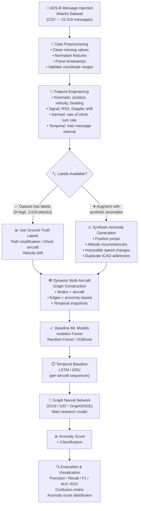

# AeroGuard AI

**Flight Trajectory Anomaly & ADS-B Spoofing Detection using Graph Neural Networks**

---

## Project Overview

AeroGuard AI is a research project that applies **Graph Neural Networks (GNNs)** to detect anomalous and spoofed aircraft behaviour in **ADS-B (Automatic Dependent Surveillance–Broadcast)** communication data. By modelling multiple aircraft and their spatial–temporal relationships as a dynamic graph, AeroGuard aims to identify spoofing attacks such as position injection, ghost aircraft, and velocity drift — going beyond single-aircraft anomaly detection toward a multi-aircraft relational approach.

## Problem Statement

ADS-B is the primary surveillance technology used in modern air traffic management. However, ADS-B was designed without built-in authentication or encryption — any entity with a software-defined radio (SDR) transmitter can broadcast fabricated ADS-B messages. This makes ADS-B inherently vulnerable to:

- **Position spoofing** — injecting false GPS coordinates to mislead air traffic control
- **Ghost aircraft injection** — creating phantom aircraft on ATC radar
- **Velocity/heading drift** — gradually altering reported speed or direction
- **Message replay attacks** — re-broadcasting previously captured legitimate messages

These vulnerabilities pose serious risks to aviation safety and airspace security.

## Motivation

- ADS-B is **mandated globally** (FAA NextGen, EASA) yet remains unauthenticated at the protocol level.
- Traditional rule-based detection methods produce high false-alarm rates and cannot adapt to evolving attack patterns.
- Most existing ML-based approaches treat each aircraft **independently**, ignoring the spatial and relational context of surrounding traffic.
- A **graph-based approach** can capture inter-aircraft relationships (proximity, convergence, relative motion) to detect anomalies that single-aircraft models miss — e.g., a spoofed aircraft whose trajectory is physically inconsistent with nearby traffic.

## Research Gap

| Existing Approaches | Limitation |
|---|---|
| Rule-based / threshold detection | High false-positive rate, cannot generalise to novel attacks |
| Single-aircraft ML (Isolation Forest, Autoencoder) | Ignores spatial context between aircraft |
| LSTM / RNN sequence models | Captures temporal patterns but not multi-aircraft relationships |
| RF fingerprinting (PHY-layer) | Requires raw IQ data; not applicable to decoded ADS-B datasets |

**AeroGuard's contribution**: Apply a **GNN-based framework** that explicitly models the **dynamic multi-aircraft graph** to detect spatially and temporally inconsistent ADS-B behaviour — combining relational reasoning with temporal anomaly detection.

---

## Selected Dataset

### Primary Dataset: ADS-B Message Injection Attacks Dataset

| Property | Details |
|---|---|
| **Name** | ADS-B Message Injection Attacks Dataset |
| **Authors** | Hadjar Ould Slimane, Selma Benouadah, Naima Kaabouch (University of North Dakota) |
| **Source** | Mendeley Data |
| **DOI** | [10.17632/6fhw732ccz.1](https://doi.org/10.17632/6fhw732ccz.1) |
| **Download** | [https://data.mendeley.com/datasets/6fhw732ccz/1](https://data.mendeley.com/datasets/6fhw732ccz/1) |
| **Size** | 22,316 ADS-B messages |
| **Format** | CSV |
| **Features** | 17 features — 15 decoded ADS-B fields + **Received Signal Strength (RSS)** + **Doppler shift** |
| **Labels** | ✅ Yes — `0` = Legitimate, `1` = Path modification, `2` = Ghost aircraft injection, `3` = Velocity drift |
| **Data Type** | Decoded ADS-B messages (not raw IQ) with signal-level features (RSS, Doppler) |
| **Real / Synthetic** | Authentic messages from OpenSky Network + simulated injection attacks |
| **Raw IQ Data** | ❌ No (includes supplementary raw ADS-B message hex, but not raw IQ samples) |
| **License** | CC BY 4.0 |

### Candidate Dataset Comparison

| Criterion | ADS-B Message Injection Attacks (Mendeley) | ADS-B Air Traffic for Anomalous Trajectory Detection (Mendeley) | ADS-B Real-World IQ Dataset (Science Data Bank) | OpenSky Network |
|---|---|---|---|---|
| **DOI / Link** | [10.17632/6fhw732ccz.1](https://doi.org/10.17632/6fhw732ccz.1) | [10.17632/4x578h29f6.1](https://doi.org/10.17632/4x578h29f6.1) | [10.57760/sciencedb.o00009.00481](https://doi.org/10.57760/sciencedb.o00009.00481) | [opensky-network.org](https://opensky-network.org/) |
| **Size** | 22,316 messages | ~139,625 messages (42 flights) | 216 files / 315 MB | Petabyte-scale |
| **Format** | CSV | CSV | Binary IQ | API / Parquet |
| **Contains IQ/RF data** | ❌ No | ❌ No | ✅ Yes (40 MHz sampling) | ❌ No |
| **Signal-level features** | ✅ RSS + Doppler shift | ❌ No | ✅ Raw IQ waveform | ❌ No |
| **Spoofing/anomaly labels** | ✅ Yes (3 attack types) | ✅ Yes (injected noise + spoofed trajectories) | ❌ No (designed for emitter ID) | ❌ No |
| **Decoded ADS-B fields** | ✅ Yes (ICAO, position, velocity, etc.) | ✅ Yes (ICAO, lat, lon, altitude, speed) | ❌ Per-emitter only (ICAO) | ✅ Yes |
| **Multi-aircraft temporal data** | ✅ Yes | ✅ Yes | ❌ Per-aircraft files | ✅ Yes |
| **Real / Synthetic** | Real + simulated attacks | Real + injected anomalies | Real RF captures | Real |
| **SDC Relevance** | High — RSS, Doppler, ADS-B protocol | Medium — trajectory only | Very High — raw RF/IQ | Low — decoded only |
| **GNN Suitability** | ✅ High — labelled, multi-aircraft, signal features | ✅ Medium — trajectory-focused, pre-split train/test | ❌ Low — per-emitter, no trajectory | ✅ Medium — large but unlabelled |

## Why This Dataset?

The **ADS-B Message Injection Attacks Dataset** is selected as the primary dataset for the following reasons:

1. **Pre-labelled attack data** — Contains ground-truth labels for three distinct attack types (path modification, ghost aircraft, velocity drift), enabling supervised training and proper evaluation without relying entirely on synthetic anomaly generation.

2. **Signal-level features (RSS + Doppler shift)** — Unlike pure trajectory datasets, this dataset includes **Received Signal Strength** and **Doppler shift**, which are communication/signal-layer features directly relevant to an SDC course. These features reflect how ADS-B signals propagate and can help distinguish legitimate transmitters from spoofing sources.

3. **Manageable size** — At ~22K messages, the dataset is practical for iterative experimentation within a course project timeline, without requiring large-scale infrastructure.

4. **Multi-aircraft context** — Contains messages from multiple aircraft with timestamps, enabling construction of dynamic multi-aircraft graphs for GNN-based analysis.

5. **Realistic composition** — Combines authentic ADS-B messages sourced from the OpenSky Network with carefully simulated injection attacks, providing a realistic evaluation scenario.

### Honest Limitation

> **This dataset contains decoded ADS-B messages with signal-level features (RSS, Doppler), NOT raw IQ/RF waveform data.** While the Science Data Bank IQ dataset provides raw RF samples at 40 MHz, it lacks trajectory information, multi-aircraft context, and spoofing labels — making it unsuitable as the primary dataset for a GNN-based trajectory anomaly detection project. The selected dataset bridges the gap between pure trajectory data and raw RF analysis by including communication-layer features alongside decoded ADS-B fields.

---

## Software Defined Communication Relevance

AeroGuard is developed under the **Software Defined Communication (SDC)** course (23AID203). The project connects to SDC concepts through the following aspects:

### Genuine SDC Connections

| SDC Concept | AeroGuard Connection |
|---|---|
| **ADS-B as a wireless communication protocol** | ADS-B operates on **1090 MHz** as a broadcast digital communication system using **Pulse Position Modulation (PPM)**. The project analyses the output of this communication channel. |
| **Signal-level features** | The selected dataset includes **Received Signal Strength (RSS)** and **Doppler shift** — physical-layer signal characteristics that are core concepts in communication systems. |
| **Digital communication vulnerability** | ADS-B's lack of authentication is a direct consequence of its communication protocol design — no encryption, no source verification at the signal level. |
| **SDR / RTL-SDR context** | The authentic messages in the dataset originate from the OpenSky Network, which collects ADS-B via **RTL-SDR receivers** — low-cost software-defined radios. The project analyses data collected through SDR infrastructure. |
| **AI-based communication analysis** | Using ML/GNN to detect spoofed communication messages represents an AI-driven approach to communication security — a modern SDC research direction. |

### Explicit Limitation

> The project works with **decoded ADS-B messages** (with signal-level features), not raw IQ samples or baseband waveforms. Signal processing tasks such as demodulation, pulse detection, and IQ-to-message conversion are **not** part of this project's scope. The SDC relevance lies in analysing the communication protocol's data and signal characteristics (RSS, Doppler) for security, rather than performing physical-layer signal processing.

---

## Proposed Methodology



### Data Preprocessing

The raw CSV data will be cleaned and prepared through the following steps:

- **Missing value handling** — Remove or impute rows with null coordinates, altitude, or timestamps
- **Timestamp parsing** — Convert to uniform datetime format; compute inter-message time intervals
- **Coordinate validation** — Filter out messages with physically impossible latitude/longitude values
- **Feature normalization** — Scale numerical features (altitude, speed, RSS, Doppler) using StandardScaler or MinMaxScaler for model compatibility
- **Temporal sorting** — Sort messages by timestamp per aircraft (ICAO address) to preserve sequential order
- **Duplicate removal** — Identify and handle duplicate or near-duplicate messages

### Feature Engineering

Features will be organized into the following categories:

| Category | Features | Description |
|---|---|---|
| **Kinematic** | Latitude, longitude, altitude, speed, heading | Core ADS-B trajectory fields |
| **Signal** | RSS, Doppler shift | Communication-layer features from the dataset |
| **Derived — Motion** | Rate of climb/descent, turn rate, acceleration | Computed from consecutive messages per aircraft |
| **Derived — Consistency** | Position delta vs. reported speed, heading vs. actual bearing | Cross-validate reported values against computed physics |
| **Temporal** | Inter-message interval, message frequency | Timing patterns per aircraft |

### Spoofing / Anomaly Generation

The selected dataset **already contains labelled attacks** (path modification, ghost aircraft injection, velocity drift). However, to increase robustness and test generalization:

#### Real attack data (from dataset):
- **Label 0**: Legitimate messages — authentic ADS-B broadcasts from OpenSky Network
- **Label 1**: Path modification — injected messages altering the aircraft's reported trajectory
- **Label 2**: Ghost aircraft injection — fabricated messages for non-existent aircraft
- **Label 3**: Velocity drift — gradual manipulation of reported speed values

#### Potential synthetic augmentation (if needed):
- **Sudden position jumps** — teleport an aircraft's reported position by an unrealistic distance between consecutive messages
- **Altitude inconsistencies** — inject altitude values physically incompatible with the reported rate of climb
- **Impossible kinematics** — create speed/heading combinations that violate aircraft performance envelopes
- **ICAO duplication** — simulate two aircraft broadcasting the same ICAO address from different locations

> **Distinction**: The dataset's labelled attacks are treated as **real attack data** (simulated by the dataset authors using established attack models). Any additional anomalies we generate during experimentation will be clearly marked as **synthetically augmented** samples.

---

## Dynamic Multi-Aircraft Graph

The core architectural idea of AeroGuard is to model the airspace as a **dynamic graph** that captures relationships between multiple aircraft at each time step.

### Graph Structure

```
G(t) = (V(t), E(t), X(t))

where:
  V(t) = set of aircraft (nodes) active at time t
  E(t) = set of edges connecting nearby aircraft at time t
  X(t) = node feature matrix at time t
```

### Node Representation (Aircraft)

Each node represents a single aircraft identified by its **ICAO24 address**. The node feature vector contains:

| Feature | Source |
|---|---|
| Latitude, Longitude | Decoded ADS-B |
| Altitude | Decoded ADS-B |
| Speed, Heading | Decoded ADS-B |
| RSS | Signal-level |
| Doppler shift | Signal-level |
| Rate of climb | Derived |
| Turn rate | Derived |
| Inter-message interval | Derived |

### Edge Construction

Edges represent **spatial proximity relationships** between aircraft:

- **Distance-based**: Connect aircraft within a defined radius threshold (e.g., 50–100 km)
- **k-Nearest Neighbours (k-NN)**: Each aircraft connects to its k nearest neighbours to ensure consistent graph connectivity
- **Edge features** (optional): Relative distance, relative bearing, closing speed between connected aircraft

### Why Relationships Between Aircraft Matter

- A spoofed aircraft may report a position that **conflicts with nearby traffic** — e.g., occupying the same airspace as another aircraft without separation
- Ghost aircraft appear **without approach trajectories** that would be consistent with surrounding traffic flow
- Velocity drift attacks may cause an aircraft's reported behaviour to diverge from what neighbouring aircraft observe indirectly through their own relative positions
- Normal traffic follows **structured flow patterns** (airways, approach corridors) — a GNN can learn these spatial regularities

### Temporal Dynamics

The graph evolves over time as aircraft enter/exit the monitored airspace:

- **Temporal snapshots**: Construct a graph at regular intervals (e.g., every 1–5 seconds)
- Aircraft that haven't transmitted recently are removed from the active node set
- New aircraft are added as they begin broadcasting
- Edges are recomputed at each snapshot based on current positions

---

## Proposed AI Models

A progressive modelling approach — from simple baselines to the main GNN research model:

### Stage 1: Baseline ML Models

| Model | Purpose |
|---|---|
| **Isolation Forest** | Unsupervised anomaly detection baseline — detects point anomalies in feature space |
| **Random Forest / XGBoost** | Supervised classification baseline — uses tabular features with ground-truth labels |

These baselines operate on **per-message features** without considering inter-aircraft relationships or temporal context.

### Stage 2: Temporal Baseline

| Model | Purpose |
|---|---|
| **LSTM / GRU** | Sequence model processing per-aircraft message sequences — captures temporal patterns in individual flight trajectories |

This captures **temporal context** but still treats each aircraft independently.

### Stage 3: Graph Neural Network (Main Research Model)

| Model | Purpose |
|---|---|
| **GCN / GAT / GraphSAGE** | Processes the dynamic multi-aircraft graph — learns from both node features and inter-aircraft relationships |

The GNN is the **main proposed model** for AeroGuard. It is hypothesized to outperform per-aircraft baselines by leveraging relational information between aircraft to detect spatially inconsistent spoofing behaviour.

> **Note**: The specific GNN variant (GCN vs. GAT vs. GraphSAGE) will be determined during implementation based on experimental performance. GAT (Graph Attention Network) is a strong candidate due to its ability to learn attention weights over neighbours, which may help the model focus on the most relevant nearby aircraft.

---

## Expected Output

For each ADS-B message or aircraft at each time step, AeroGuard will produce:

1. **Anomaly score** — A continuous value indicating the likelihood of spoofing/anomaly
2. **Binary classification** — Normal vs. anomalous
3. **Attack type classification** — If anomalous, classify as path modification / ghost aircraft / velocity drift
4. **Visualization** — Anomaly score heatmaps, flagged trajectories on airspace plots, graph structure visualization

---

## Current Progress

### Completed ✅

- [x] Project problem defined — ADS-B spoofing detection using GNN
- [x] Literature review and research direction established
- [x] Dataset investigation completed — compared 4 candidate datasets
- [x] Primary dataset selected — ADS-B Message Injection Attacks Dataset (Mendeley)
- [x] Proposed methodology defined — preprocessing → features → graph → baseline → GNN pipeline
- [x] SDC relevance documented

### Implementation Status

> ⚠️ **Implementation has not started yet.** No code has been written, no models have been trained, and no experiments have been conducted. This README documents the current project direction and planned approach.

---

## Next Steps

1. **Download and inspect** the selected dataset — examine file structure, column names, data types, value distributions
2. **Perform exploratory data analysis (EDA)** — statistical summaries, missing value analysis, class distribution, feature correlations
3. **Build preprocessing pipeline** — cleaning, normalization, feature extraction, temporal ordering
4. **Generate/identify anomaly samples** — use existing labels; optionally augment with synthetic anomalies
5. **Establish baseline models** — train Isolation Forest and Random Forest/XGBoost on per-message features
6. **Implement dynamic graph construction** — build temporal graph snapshots from multi-aircraft data
7. **Develop GNN model** — implement and evaluate GCN/GAT on the dynamic aircraft graph
8. **Evaluate and compare** — benchmark GNN against baselines using precision, recall, F1, AUC-ROC

---

## References

1. **Dataset**: Ould Slimane, H., Benouadah, S., & Kaabouch, N. (2022). *ADS-B Message Injection Attacks Dataset*. Mendeley Data, V1. DOI: [10.17632/6fhw732ccz.1](https://doi.org/10.17632/6fhw732ccz.1)

2. **Trajectory Anomaly Dataset**: Fried, A. *ADS-B Air Traffic for Anomalous Trajectory Detection*. Mendeley Data, V1. DOI: [10.17632/4x578h29f6.1](https://doi.org/10.17632/4x578h29f6.1)

3. **IQ Signal Dataset**: Zhang, X. (2022). *ADS-B Real-World Data Set (DF=17)*. Science Data Bank. DOI: [10.57760/sciencedb.o00009.00481](https://doi.org/10.57760/sciencedb.o00009.00481)

4. **OpenSky Network**: Schäfer, M., Strohmeier, M., Lenders, V., Martinovic, I., & Wilhelm, M. (2014). *Bringing Up OpenSky: A Large-scale ADS-B Sensor Network for Research*. In Proc. IPSN, pp. 83–94.

5. **GNN for ADS-B**: SR-GNN — *Spectral Residuals with Graph Neural Networks for Anomaly Detection in ADS-B Data*. (Combines spectral residual analysis with dual GNNs for flight trajectory anomaly detection.)

6. **ADS-B Security Survey**: *Towards Secure Air Traffic Surveillance: A Survey on ADS-B Threats, Existing Solutions, and Future Research* — Comprehensive taxonomy of ADS-B security including AI-based intrusion detection systems.

7. **PHY-Layer Detection**: SODA — *Spoofing Detector for ADS-B* — Two-stage DNN for physical-layer ADS-B authentication using IQ samples and phase characteristics.

---

## Project Status

| | |
|---|---|
| **Current Stage** | 📋 Dataset Selection + Methodology Definition |
| **Next Stage** | 🔬 Dataset Exploration + Preprocessing |
| **Course** | 23AID203 — Software Defined Communication |
| **Approach** | Graph Neural Network for multi-aircraft ADS-B anomaly detection |
