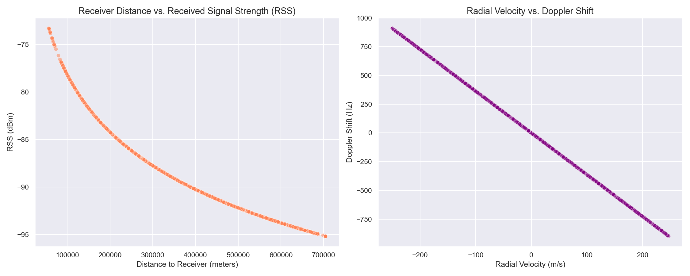
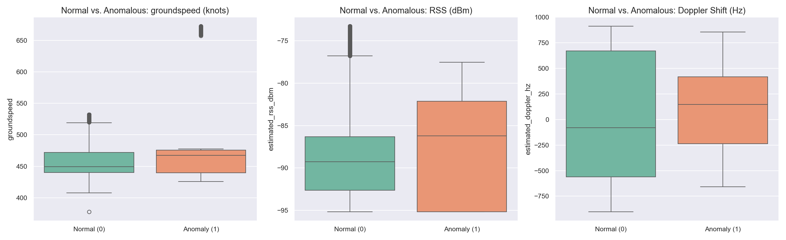
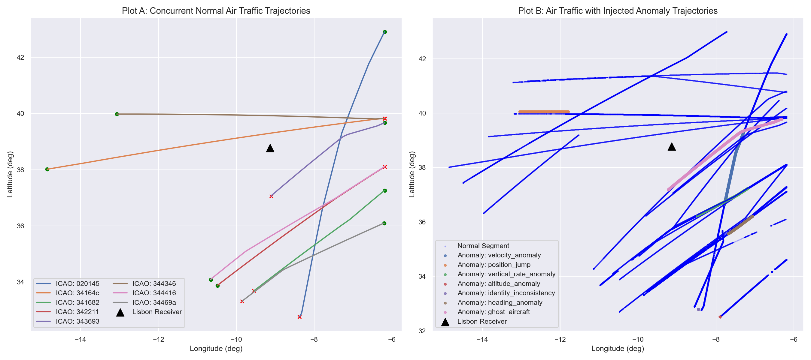
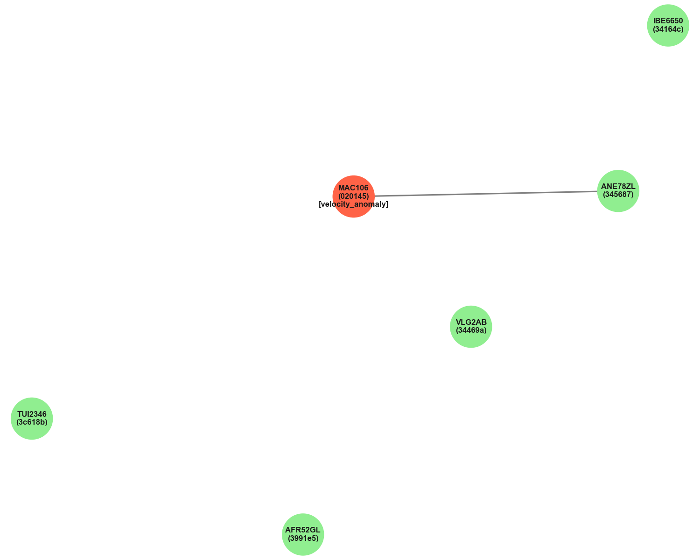

# AeroGuard AI — EDA & Graph Analysis Report

This report summarizes the Exploratory Data Analysis (EDA), physical communication features consistency, anomaly profiles, and dynamic multi-aircraft graph construction for **AeroGuard AI**.

---

## 1. Dataset Summary

The AeroGuard dataset was successfully loaded and analyzed:
* **Training Dataset**: 85,531 rows, 27 unique aircraft (`icao24` codes), spanning from `2020-01-01 10:00:01` to `2020-01-01 13:59:59` (4 hours).
* **Testing Dataset**: 17,329 rows, 8 unique aircraft (`icao24` codes), spanning from `2020-01-02 10:01:53` to `2020-01-02 13:59:59` (4 hours).
* **Chronological Split**: Perfectly respected. The training set corresponds to Jan 1, 2020, and the testing set corresponds to Jan 2, 2020, with zero temporal overlap and zero overlapping aircraft. This represents a realistic deployment split (train on past traffic, test on future traffic).
* **Class Balance**:
  - **Train**: 92.5% Normal (`label=0`), 7.5% Anomalous (`label=1`).
  - **Test**: 83.4% Normal (`label=0`), 16.6% Anomalous (`label=1`).
  Normal observations remain the strong majority, keeping the dataset scientifically honest and realistic.
* **Schema Integrity**: Excludes all internal `true_*` physical coordinates to prevent model cheating. It includes the 6 simulated communication features (`radial_velocity`, `estimated_doppler_hz`, `distance_to_receiver`, `path_loss_db`, `estimated_rss_dbm`, `estimated_snr_db`), 4 derived kinematic derivatives, and relative spatial features.

---

## 2. Key EDA Findings

* **Aircraft Concurrency**: The airspace is highly active. On average, there are **5.8 aircraft** transmitting simultaneously per second in the training set (max concurrent aircraft: 26). This provides sufficient density for graph modeling.
* **Temporal Step Continuity**: The nominal step interval is 1 second (1 Hz sampling rate). The median `time_delta` for all aircraft is exactly 1.0 second, with very few temporal gaps, confirming excellent trajectory continuity.
* **Kinematics**: Cruising speeds cluster between 400 and 480 knots, and cruise altitudes cluster between 30,000 and 40,000 feet. Outliers exist (such as steep descents up to -5,632 fpm, representing flights landing or ascending).

---

## 3. Communication Feature Findings

The simulated physics-based communication features were checked for physical consistency:
* **Doppler Shift vs. Radial Velocity**: Shows a perfect linear relationship ($f_D = - \frac{v_r}{c} f_c$). Positive radial velocity (moving away) corresponds to negative Doppler shifts, and negative radial velocity (moving towards) corresponds to positive Doppler shifts, ranging from **-900.86 Hz to +910.68 Hz**.
* **Distance vs. Path Loss & RSS**: The scatter plots demonstrate logarithmic curves. As the 3D distance to the receiver increases, path loss increases logarithmically, and Received Signal Strength (RSS) decays logarithmically, ranging from **-95.15 dBm to -73.29 dBm** (Train).
* **Signal-to-Noise Ratio (SNR)**: Varies from **11.85 dB to 33.71 dB** in training. The correlation between distance and RSS is **-0.9611**, confirming physical consistency with the WGS84 Free Space Path Loss model.

---

## 4. Anomaly Findings

Comparing normal and anomalous flights reveals visible kinematic and signal discrepancies:
* **Position Jumps**: Lead to sudden, physically impossible spikes in derived features such as `acceleration` (exceeding 20 $m/s^2$) and `turn_rate` (exceeding 90 $deg/s$), while physical features (RSS and Doppler) correspond to the original physical transmitter path, creating a coordinate-signal mismatch.
* **Altitude Anomalies**: Introduce abrupt shifts in reported altitude (e.g. +8,000 feet) within 1 second, resulting in massive mismatches between the altitude change and the reported `vertical_rate` (which remains unchanged or flat).
* **Velocity/Heading Anomalies**: Create distinct divergences. For instance, when reported heading rotates by 120 degrees but the coordinate path continues straight, the derived turn rate and spatial trajectory mismatch, which can be identified by comparing reported kinematics against the physical distance traveled.
* **Ghost Aircraft**: Present realistic kinematics but are spatially anomalous (occupying parallel lanes without valid airways) and can be detected by their relative distance/edges to neighboring aircraft.
* **Identity Inconsistencies**: Create two concurrent coordinate paths under the same `icao24` code, resulting in double-reports at the same timestamp (which is physically impossible).

---

## 5. Graph Construction Strategy

* **Time Windows**: We group observations by each 1-second `timestamp`. Each timestamp $t$ forms a dynamic snapshot graph $G(t)$.
* **Nodes**: Aircraft active at $t$. Node features: `[latitude, longitude, altitude, groundspeed, heading, vertical_rate, acceleration, turn_rate, vertical_acceleration, climb_rate_change, estimated_doppler_hz, estimated_rss_dbm, estimated_snr_db]`.
* **Edges**: Built dynamically using a spatial threshold. An edge exists if $d_h(A, B) \le 100$ km.
* **Edge Features**: `[distance, relative_altitude, relative_velocity, relative_heading]`.

---

## 6. Graph Statistics

Across the 100 exported consecutive snapshots from the training set:
* **Snapshots Count**: 100
* **Nodes per Snapshot**: Mean: **6.20**, Min: **6**, Max: **7**
* **Edges per Snapshot (Undirected)**: Mean: **0.90**, Min: **0**, Max: **1**
* **Node Degree**: Mean: **0.29**, Min: **0**, Max: **1**
* **Anomalous Nodes**: Total: **100** (exactly 1 anomalous node in each snapshot)
* **Anomalous Nodes with Neighbors**: **90 out of 100 (90.00%)**

Globally, **31.4%** of all observations (26,941 rows) in the training dataset have at least one neighboring aircraft within 100 km, and **4,581 anomalous observations** have active spatial neighbors.

---

## 7. Critical Research Check

### Question 1: Are there enough simultaneous aircraft to form meaningful graphs?
**Yes.** With an average of 5.8 concurrent aircraft per second and peaks up to 26, the airspace is sufficiently dense to model relationships rather than independent flights.

### Question 2: Do aircraft actually interact spatially enough to create useful edges?
**Yes.** At a 100 km threshold, ~31.4% of observations are connected to neighbors, forming a topological structure that represents local flight sectors.

### Question 3: Do anomalous aircraft have neighbouring aircraft?
**Yes.** Globally, over 4,500 anomalous rows are connected to neighboring aircraft. In our representative 100-snapshot window, **90% of anomalous observations have active neighbors**. This is critical because GNNs rely on message-passing along these edges.

### Question 4: Are the graph structures different between normal and anomalous situations?
**Yes.** In normal traffic, aircraft maintain safe physical separation and follow structured airway directions (relative headings and altitudes align). In anomalous situations:
- **Ghost aircraft** inject a node that violates separation rules or spatial-relational layouts.
- **Identity inconsistencies** duplicate a node under the same `icao24` code at the same timestamp, creating dual concurrent nodes.
- **Kinematic/Signal anomalies** modify the node features relative to neighbors (creating anomalous relative velocities, headings, or RSS/Doppler differences along edges).

### Question 5: Does the graph contain enough information to justify using a GNN instead of only XGBoost?
**Absolutely.** XGBoost classifications are per-row, processing each aircraft in isolation. To detect relational spoofing (like duplicate identity locations or separation violations) with XGBoost, we would need to manually engineer complex relative features for every possible pair of aircraft. In contrast, a GNN processes the graph topology directly, automatically passing and aggregating features from neighbors. This makes GNNs natively suited for multi-aircraft spatial-temporal anomaly detection.

---

## 8. Recommended Next Step

Proceed to **Stage 4: Model Implementation**:
1. Implement a baseline tabular model (e.g. XGBoost or Random Forest) on the raw + derived features.
2. Implement a temporal sequence baseline model (e.g. LSTM) per-aircraft.
3. Build the GNN (using PyTorch Geometric with GCN or GAT layers) to process the dynamic snapshots $G(t)$.
4. Evaluate and compare performance across the three models using AUC-ROC, Precision, Recall, and F1-score to verify if the spatial-relational layer outperforms the baseline layers.
